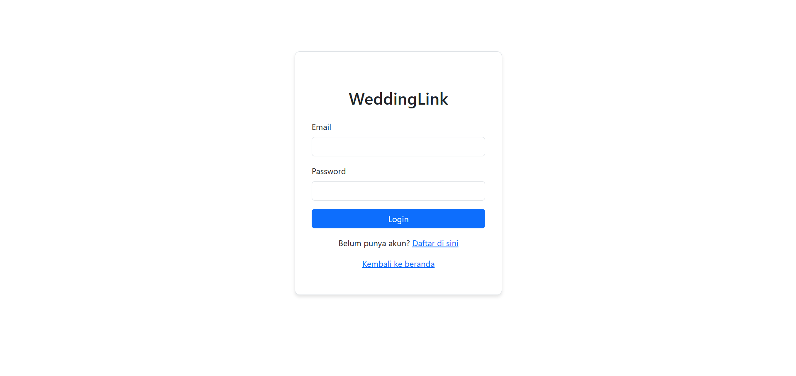
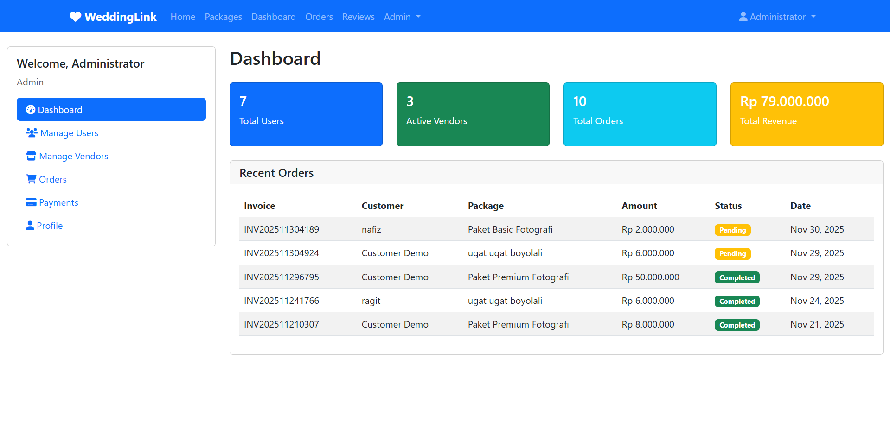
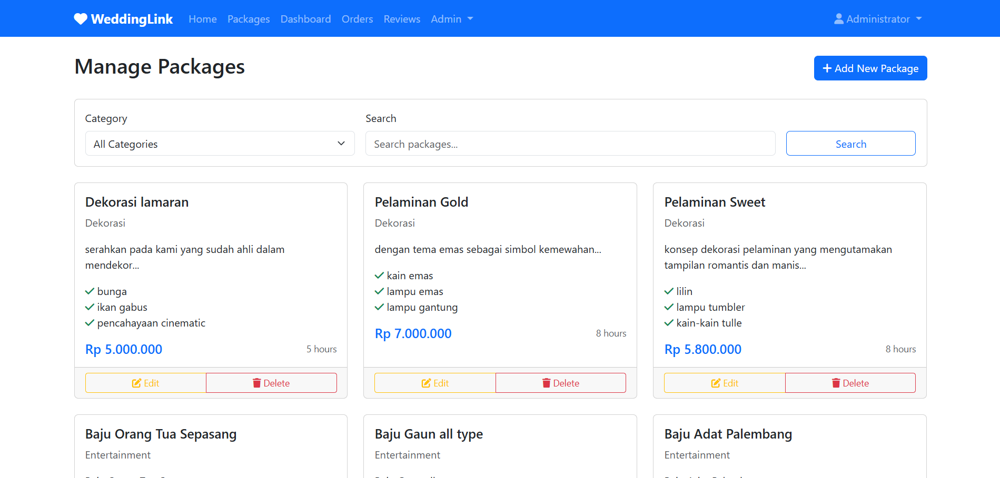
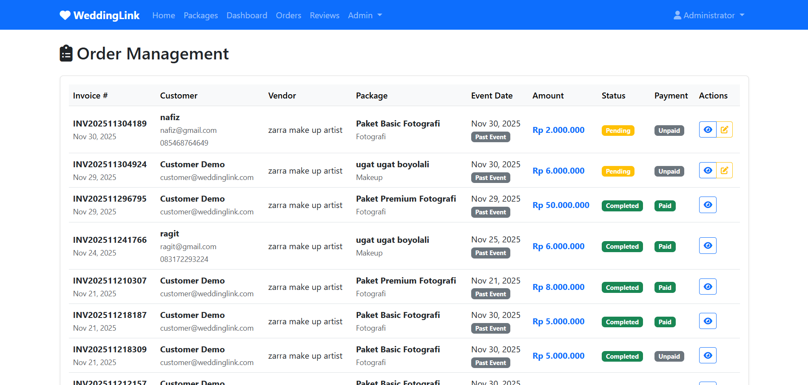

=======
# 🚀 Final Project RPL — WeddingLink

<p align="center">
  
</p>

<p align="center">
  
  
  
  
  
</p>
---

## 👥 Identitas Kelompok
- **Nama Kelompok :** 9
- **Anggota & Jobdesk :**

  | Nama Anggota | Tugas / Jobdesk |
  |--------------|-----------------|
  | Nadhif Pandya Supriyadi (701230024) | membuat use case,activity, sequence, ERD, class diagram, Membuat program menggunakan PHP Native. Mengimplementasikan proses CRUD dan session login. Mendesain tabel MySQL dan menyediakan file database.sql. Melakukan deployment melalui FileZilla ke InfinityFree dan pengecekan pasca-upload. |
  | Novi Astina Wijayanti (701230088) | Design (UML, UI) |
  | Dewi Lupiani (701230054) | Implementasi Backend |

z
---

## 📱 Deskripsi Singkat Aplikasi

WeddingLink adalah platform web yang menghubungkan calon pengantin dengan penyedia jasa pernikahan. Aplikasi ini memfasilitasi proses pencarian, pemesanan, dan pembayaran berbagai jasa pernikahan seperti fotografi, dekorasi, catering, dan makeup dalam satu sistem terintegrasi.

---

## 🎯 Tujuan Sistem / Permasalahan yang Diselesaikan

**Permasalahan:**

1. Kesulitan mencari vendor pernikahan yang terpercaya
2. Proses booking yang manual dan tidak terpusat
3. Sulitnya membandingkan harga dan paket dari berbagai vendor
4. Tidak adanya sistem pembayaran dan tracking yang terintegrasi

**Solusi yang Ditawarkan:**

1. Marketplace terpusat untuk semua vendor pernikahan
2. Sistem booking online dengan konfirmasi real-time
3. Perbandingan harga dan paket dalam satu platform
4. Sistem pembayaran terintegrasi dengan tracking status

---

## 🛠️ Teknologi yang Digunakan

**Backend**

1. PHP 8.2+ - Bahasa pemrograman utama
2. MySQL - Database management system
3. PDO - Database connection dengan prepared statements
4. Sessions - Manajemen autentikasi

**Frontend**

1. Bootstrap 5.3 - Framework CSS responsive
2. Font Awesome 6 - Icon library
3. Vanilla JavaScript - Interaktivitas client-side
4. Custom CSS - Styling tambahan

**Security Features**

1. CSRF Protection - Token security untuk semua form
2. SQL Injection Prevention - Prepared statements
3. XSS Protection - Input sanitization dengan htmlspecialchars()
4. File Upload Security - Validasi type, size, dan content
5. Password Hashing - Bcrypt password encryption
6. Session Security - Regenerasi session ID

---

## 🚀 Cara Menjalankan Aplikasi

### Cara Instalasi

1. Clone repository:

```bash
git clone https://github.com/nadhifpandyas/weddinglink.git
```

2. Pindah ke direktori project:

```bash
cd weddinglink
```

3. Pastikan XAMPP/Laragon sudah terinstal

### Cara Konfigurasi

1. Import database:

   * Buka phpMyAdmin (`http://localhost/phpmyadmin`)
   * Buat database baru bernama `weddinglink`
   * Import file `weddinglink.sql` yang ada di folder project

2. Konfigurasi koneksi database:

   * Buka file `config.php`
   * Sesuaikan konfigurasi database:

```php
define('DB_HOST', 'localhost');
define('DB_NAME', 'weddinglink');
define('DB_USER', 'root');
define('DB_PASS', ''); 
```

3. Konfigurasi folder uploads:

   * Pastikan folder `uploads/payments/` memiliki permission write
   * Di Windows: Klik kanan folder → Properties → Security → Edit permissions
   * Di Linux: `chmod 755 uploads/payments/`

### Cara Menjalankan (Run Project)

1. Start Apache dan MySQL di XAMPP/WAMP
2. Letakkan folder project di `htdocs` (XAMPP) atau `www` (WAMP)
3. Buka browser dan akses:

```
http://localhost/weddinglink/
```

atau

```
http://localhost/weddinglink/index.php
```

---

## 🔑 Akun Demo

**Admin:**

* Username: `admin@weddinglink.com`
* Password: `password`

**Vendor:**

* Username: `foto@weddinglink.com`
* Password: `password`

**Customer:**

* Username: `customer@weddinglink.com`
* Password: `password`

---

## 🌐 Link Deployment

* **Website WeddingLink:** [https://weddinglink.ct.ws/](https://weddinglink.ct.ws/)
* **Repository GitHub:** [https://github.com/nadhifpandyas/weddinglink.git](https://github.com/nadhifpandyas/weddinglink.git)
* **Demo Video:** [Link YouTube Demo](https://youtu.be/IoTgQHpKeKY?si=oki_KbvHfjIHZJzp)

---

## 📸 Screenshot Halaman Utama

### Halaman Login



### Dashboard Admin



### Daftar Paket



### Halaman Pemesanan



---

## 📝 Catatan Tambahan

### Keterbatasan Sistem

1. **Pembayaran:** Sistem hanya mendukung manual transfer dengan upload bukti, belum terintegrasi dengan payment gateway
2. **Notifikasi:** Belum ada sistem notifikasi real-time (email/WhatsApp)
3. **Mobile App:** Hanya tersedia versi web, belum ada aplikasi mobile
4. **Multi-language:** Hanya tersedia dalam Bahasa Indonesia

### Fitur yang Belum Selesai

1. ❌ Sistem rating dan review untuk vendor
2. ❌ Fitur chat antara customer dan vendor
3. ❌ Export laporan ke format PDF/Excel
4. ❌ Calendar view untuk booking
5. ❌ Integrasi dengan Google Maps untuk lokasi vendor

### Petunjuk Penggunaan Khusus

1. **Untuk Vendor:** Setelah registrasi, tunggu verifikasi dari admin sebelum dapat menambahkan paket
2. **Upload Bukti Bayar:** Hanya menerima file JPG/PNG maksimal 2MB
3. **Status Order:**

   * Pending: Menunggu konfirmasi vendor
   * Confirmed: Dikonfirmasi vendor
   * In Progress: Sedang diproses
   * Completed: Selesai
   * Cancelled: Dibatalkan
4. **Demo Data:** Database sudah include sample data untuk testing

### Troubleshooting

1. **Error koneksi database:** Pastikan MySQL berjalan dan konfigurasi di config.php benar
2. **Upload gagal:** Cek permission folder uploads/payments/
3. **Halaman blank:** Cek error log di `logs/error.log` atau aktifkan error reporting di config.php
4. **Login gagal:** Pastikan menggunakan akun demo yang benar atau reset password melalui phpMyAdmin

---

## 📚 Keterangan Tugas

Project ini dibuat untuk memenuhi **Tugas Final Project Mata Kuliah Rekayasa Perangkat Lunak**

**Dosen Pengampu:**

* **Nama:** Dila Nurlaila, M.Kom.
* **Mata Kuliah:** Rekayasa Perangkat Lunak
* **Program Studi:** Sistem Informasi
* **Universitas:** UIN STS Jambi

---

### Scope Project yang Dikembangkan:

1. ✅ Analisis kebutuhan dan perancangan sistem
2. ✅ Implementasi database dengan MySQL
3. ✅ Pengembangan backend dengan PHP native
4. ✅ Implementasi frontend dengan Bootstrap
5. ✅ Testing dan debugging
6. ✅ Dokumentasi sistem

### Fitur Wajib yang Telah Diterapkan:

1. ✅ Sistem login/register multi-role
2. ✅ CRUD untuk semua entitas utama
3. ✅ Sistem pembayaran dengan upload bukti
4. ✅ Manajemen order dengan berbagai status
5. ✅ Dashboard dengan statistik per role
6. ✅ Responsive design

---

## 📄 Lisensi

© 2025 WeddingLink - Kelompok 9 RPL

---

